# QRadar Lab2 - Create a new QRadar App

Use IBM® QRadar® apps to extend and enhance your current QRadar deployment with new data and ready-to-use use cases.

A QRadar app is a means to augment and enrich your current QRadar system with new data and functionality. You can download and install other shared apps that are created by IBM, its Business Partners, and other QRadar customers.

Apps provide new tabs, API methods, dashboard items, pop-up menus, toolbar buttons, configuration pages, and more within the QRadar user interface. The functionality is entirely defined by Python Flask framework apps that serves the app endpoints from a secure container. 

## Objective

This lab will walk you through steps to build, modify and delete an application in QRadar console.

The QRadar App Editor is an easy-to-use editor that any app developer can use. When you use the App Editor to develop a new app or import an existing app, the App Editor is on the app development tab. The App Editor is a ready-made workspace for you to manage the development of your app.

### What you can do with the QRadar App Editor

- Develop new apps from a starter template automatically imported from the IBM sample apps repository.
- Import and edit existing apps via file upload or cloning a git repository.
- Delete apps that you create with the App Editor.
- Add, edit, reorder and remove files and folders.
- Clone an app from a Git repository.
- Deploy apps that you’re editing and developing.
- Export apps.

### How the App Editor works

When you install a new app or import an existing app into QRadar, you use the App Editor to edit and create files and folders on the app development tab. When you’re satisfied with your changes, you can deploy the app to live mode to represent how the app functions in QRadar. In live mode the app development tab is removed.

## Tools Used

You use the following tools to build a new app in QRadar.

- QRadar
- QRadar App Editor
- Python

## Requirements

- Access to QRadar system
- IBM ID to access `IBM X-Force Exchange / App Exchange`

## Lab Flow

During the lab, you are going to
- install the QRadar App Editor into your QRadar system
- create a Hello World app via QRadar App Editor
- modify the Hello World app via QRadar App Editor
- delete the Hello World app via QRadar App Editor

### Part 1 - Install QRadar App Editor

To install the QRadar App Editor,

1. Download the QRadar App Editor extension from the `IBM X-Force Exchange / App Exchange` (https://exchange.xforce.ibmcloud.com/). For example, qradarappeditor_2.2.0.zip.
    - Login to the `IBM X-Force Exchange / App Exchange` (https://exchange.xforce.ibmcloud.com/).
    - Search for `QRadar App Editor`.
        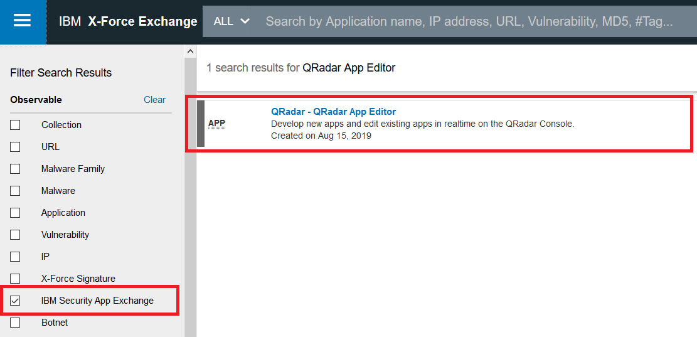
    - Select the `IBM Security App Exchange` checkbox in the navigation pane on the left.
    - Click `QRadar - QRadar App Editor` link.
    - `Download`. Make sur ethe pop-up block is off for your browser.

1. Login to QRadar console.

1. Navigate to `Admin` tab.

    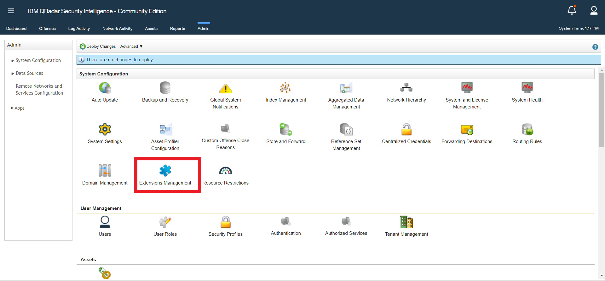

1. Click `Extensions Management`.

    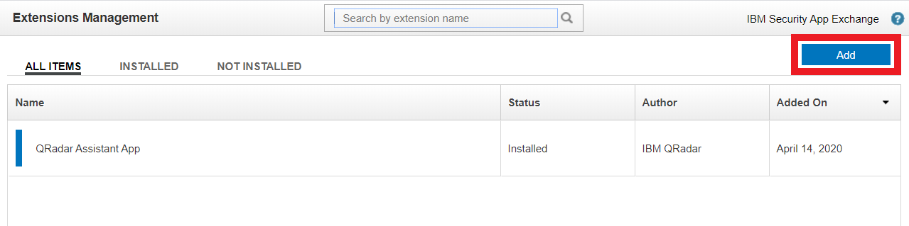

1. Click `Add`.

    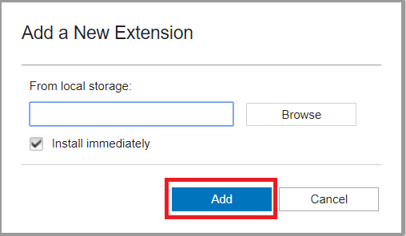

1. In the `Add a New Extension` window, click `Browse` to find the app extension that you downloaded.

1. Select `Install immediately` checkbox.

1. Click `Add`. The downloaded zip file is unziped and verified.

    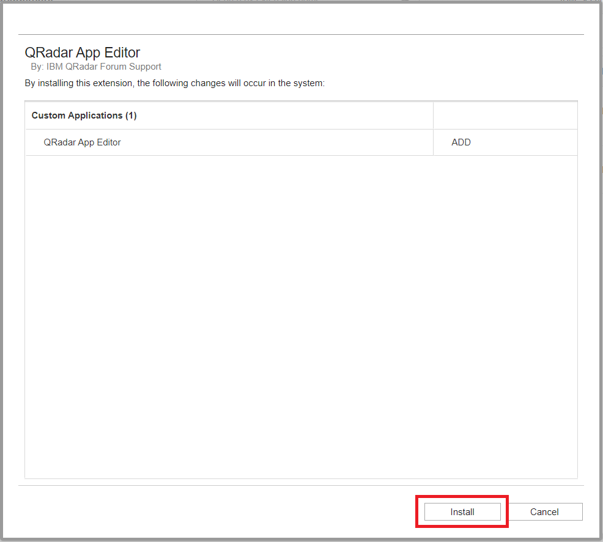

1. Click `Install`. 

1. Click `OK` after the `QRadar App Editor` installation is completed.

1. The `QRadar App Editor` extension appears in the `Extensions Management` window after it is installed.

    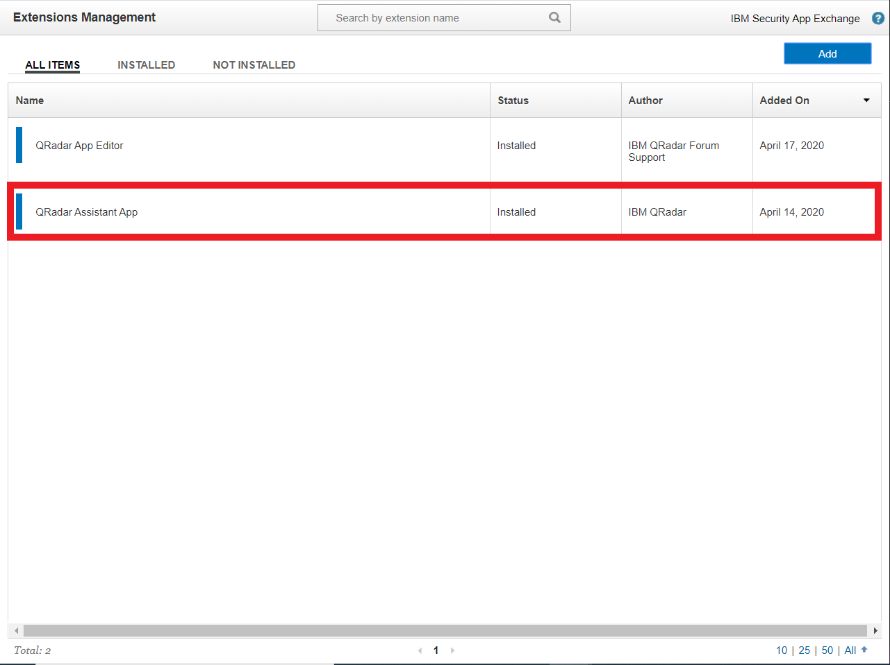

1. Close the `Extensions Management` window. You are back to the `Admin` tab of QRadar console. 

1. Refresh your browser. This brings you to the `Dashboard` tab.

1. Go back to `Admin` tab and scroll down. If the `Develop Applications` icon appears on the `Admin` tab, you are ready to move onto the next step. Skip the rest setps in this section. 

    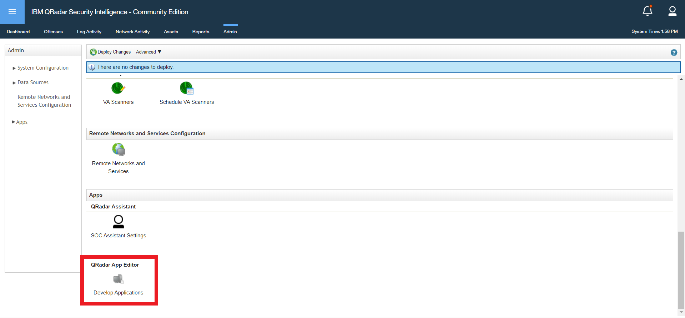

1. If the `Develop Applications` icon does not appears on the `Admin` tab, and the message **"There are undeployed changes. Click 'Deploy Changes' to deploy them. View Details"** is displayed on the top of the tab, click `Deploy Changes` link above the message.

    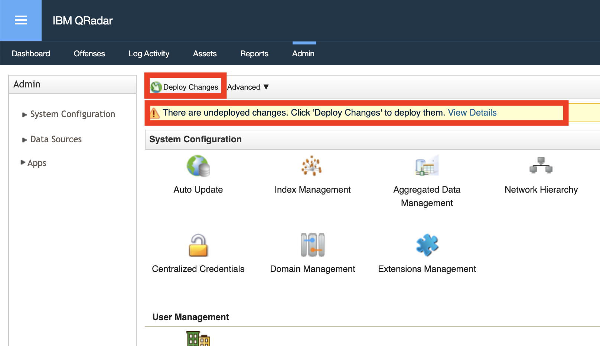

1. This may take a minute or so.

1. After the new changes are deployed, scroll down in the `Admin` tab. The `Develop Applications` icon appears.

    

1. Refresh the browser.

### Part 2 - Create Hello World app

To create a Hello World app via QRadar App Editor,

1. Login to QRadar console.

1. Navigate to `Admin` tab.

    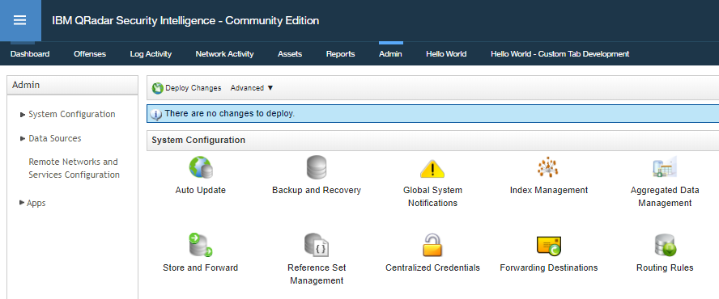

1. In the navigation menu of the left pane, click `Apps` to expand the section.

    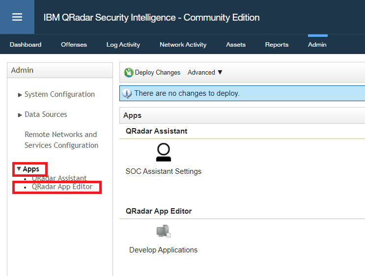

1. Click the `QRadar App Editor` entry in the navigation menu. This filters the display items in the main section of the QRadar console.

    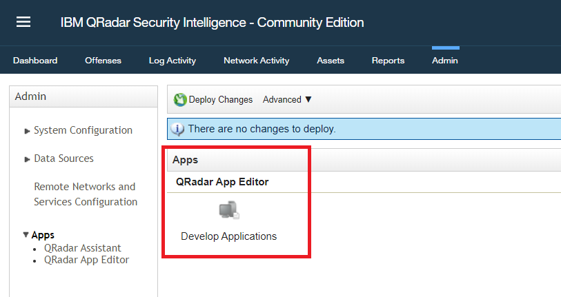

1. Click the `Develop Applications` icon under `Apps` section in the main window to open the `QRadar App Editor`.

    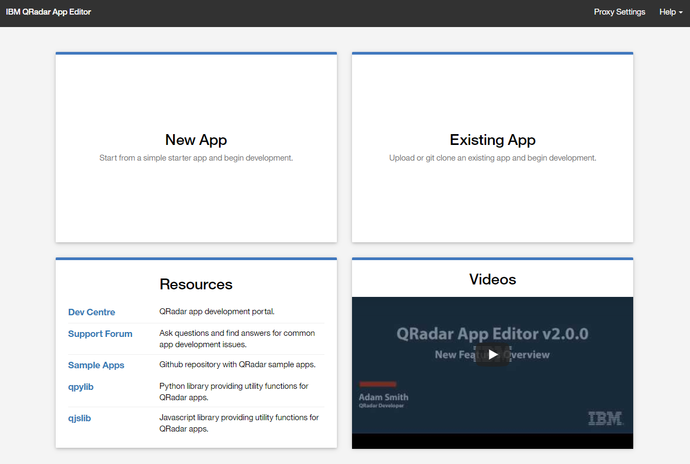

1. Available features in the `ARadar App Editor` include

    - New App -	Develop a new app by using the Hello World built-in template or by selecting one of the other templates that you clone from a Git repository.
    - Existing App - Edit or develop an existing app that you import into the QRadar App Editor, or clone from a Git repository.
    - Resources - Development resources
    - Getting Started Video - Learn to use the QRadar App Editor. 

1. Select `New App` tile to start creating a new application.

    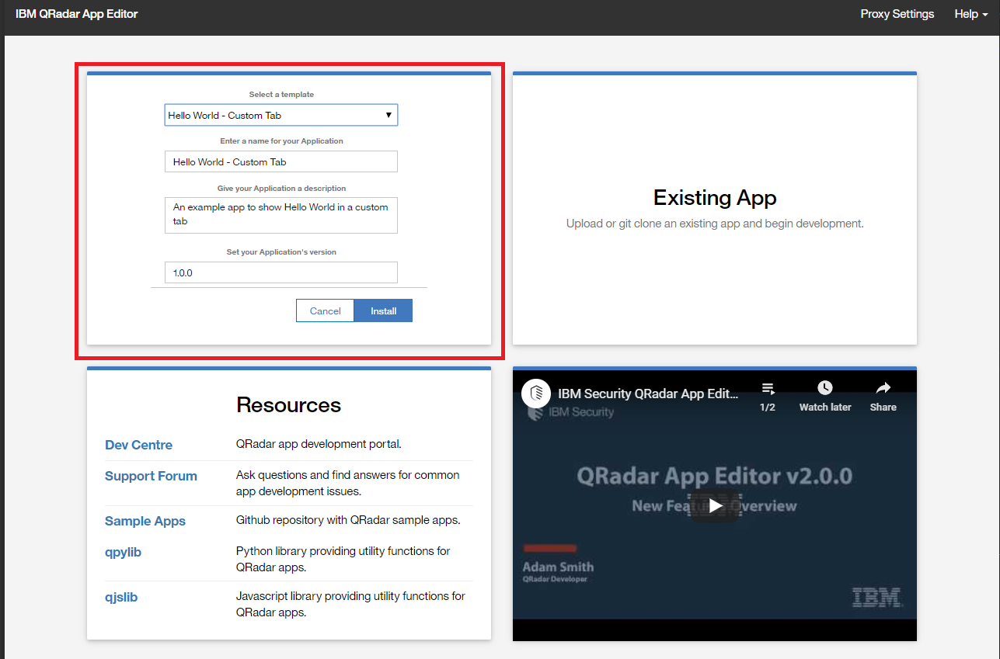

1. Select `Hello World - Custom Tab` as the `template`. Other templates are available. Click the dropdown menu to view additional templates.

1. Accept the default value for the rest of fields.
    - Enter a name for your Application
    - Give your Application a description
    - Set your Application's version

1. Click `install`. 

1. This may take a few minutes. While the `App Editor` creates the new application, it shows deployment stage status at the bottom of the window. 

1. After the new `Hello World` application is created, switch back to the `QRadar console`.

1. Refresh the browser.

    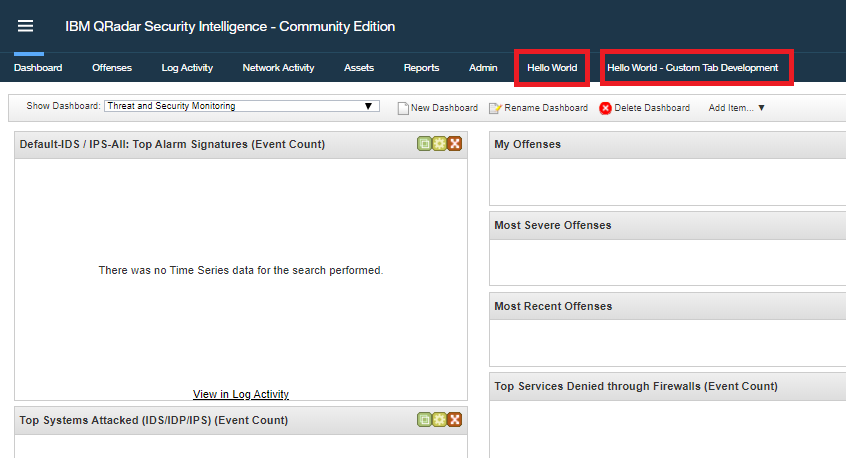

1. Two new tabs become available.
    - Hello World
    - Hello World - Custom Tab Development

1. Click the new tab `Hello World`. Message `Hello World!` is displayed. 

    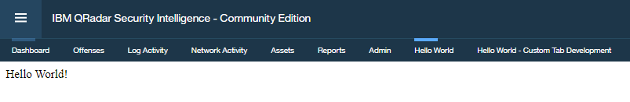

1. Congrtulation! You successfully created a new application.

### Part 3 - Modify Hello World app

New application is developed in Python. To modify the Hello World app via QRadar App Editor,

1. Login to QRadar console.

1. Navigate to `Hello World - Custom Tab Development` tab. This is where you modify/develop your application. New application is developed in Python. Explore the files through the navigation menu in the left pane.

    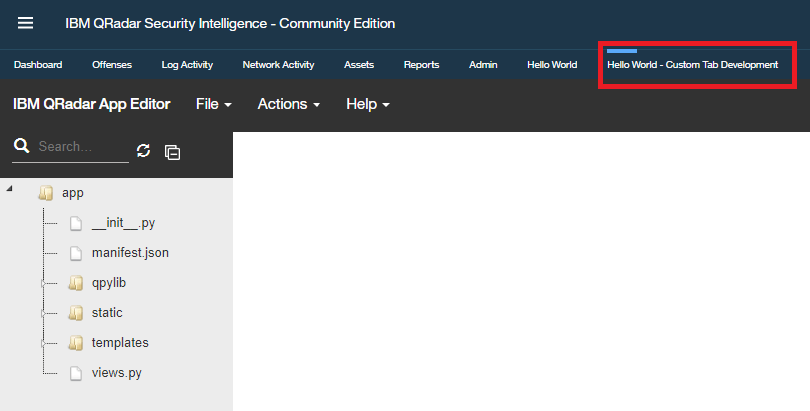

1. In the navigation menu of the left pane, expand folder `templates`.

    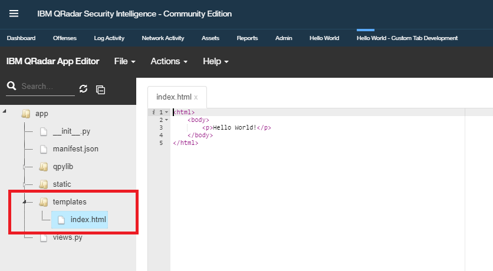

1. Double click the `index.html` file to open it in the main section.

1. Change the code `
Hello World!
` to `
Hello Beautiful World!
`.

1. Select `File` menu from the menu bar on the top and then select `Save`.

1. Click the tab `Hello World`. Message `Hello Beautiful World!` is displayed. 

    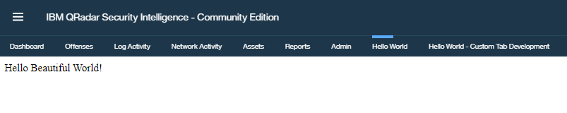

1. Congrtulation! You successfully modified your application.

### Part 4 - Delete Hello World app

To delete the Hello World app via QRadar App Editor,

1. Login to QRadar console.

1. Navigate to `Hello World - Custom Tab Development` tab. This is where you modify/delete your application.

    

1. Select `Action` menu from the menu bar on the top and then select `Delete App`.

1. Select `Yes`.

1. Your app will be deleted in a few seconds.

    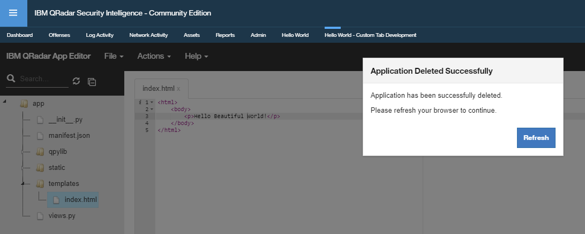

1. Click `Refresh` in the confirmation pop-up window. 

1. Congrtulation! You successfully deleted your application.

    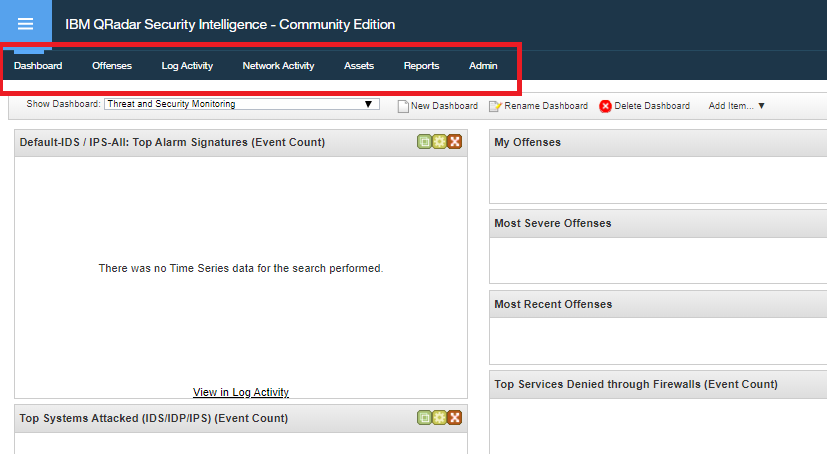

## Related Links

- [Open Cybersecurity Alliance](https://opencybersecurityalliance.org/)
- [IBM QRadar SIEM](https://www.ibm.com/products/qradar-siem)
- [IBM QRadar Log Manager](https://www.ibm.com/products/qradar-log-manager)
- [IBM QRadar Vulnerability Manager](https://www.ibm.com/products/ibm-qradar-vulnerability-manager)
- [IBM QRadar on Cloud](https://www.ibm.com/products/hosted-security-intelligence)
- [IBM QRadar Advisor with Watson](https://www.ibm.com/products/cognitive-security-analytics)
- [IBM QRadar Network Insights](https://www.ibm.com/products/real-time-threat-identification)
- [IBM QRadar Incident Forensics](https://www.ibm.com/products/ibm-qradar-incident-forensics)

