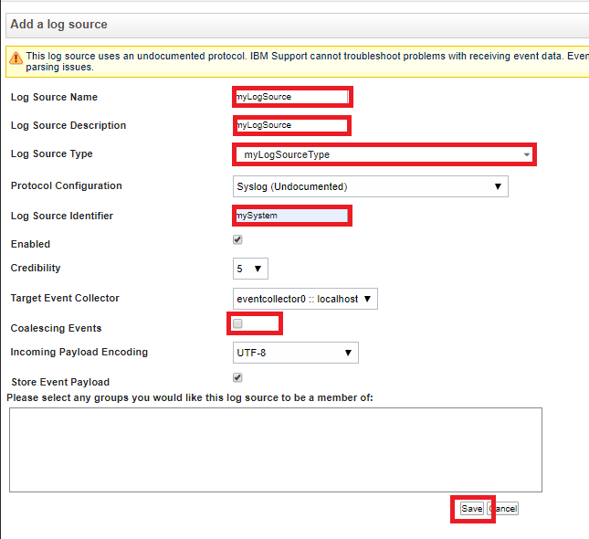

# QRadar Lab1 - Create a new DSM


## QRadar Flow

A Device Support Module (DSM) is a code module that parses received events from multiple log sources and converts them to a standard taxonomy format that can be displayed as output. 

To collect events from third-party devices/sources, you need to complete configuration tasks on the third-party device, and your QRadar Console, Event Collector, or Event Processor. The key components that work together to collect events from third-party devices are log sources, DSMs, and automatic updates.

### Log sources 

A log source is any external device, system, or cloud service that is configured to either send events to your IBM QRadar system or be collected by your QRadar system. QRadar shows events from log sources in the Log Activity tab. 

To receive raw events from log sources, QRadar supports several protocols, including syslog from OS, applications, firewalls, IPS/IDS, SNMP, SOAP, JDBC for data from database tables and views. QRadar also supports proprietary vendor-specific protocols such as OPSEC/LEA from Checkpoint.

### DSMs 

A Device Support Module (DSM) is a code module that parses received events from multiple log sources and converts them to a standard taxonomy format that can be displayed as output. Each type of log source has a corresponding DSM. For example, the IBM Fiberlink MaaS360 DSM parses and normalizes events from an IBM Fiberlink MaaS360 log source.


## Objective

After the events are collected and before the correlation can begin, individual events from your devices must be properly normalized. 

Normalization means to map information to common field names, such as event name, IP addresses, protocol, and ports. If an enterprise network has one or more network or security devices that QRadar does not provide a corresponding DSM, you can create a new DSM or use the Universal DSM. Before you define device extension information in the Log Sources window in the Admin tab, you must create an extensions document for the log source. 

This lab will walk you through steps to build a new DSM via SAM Editor in QRadar console.


### What you can do with the QRadar DSM Editor

- Extract fields
- Define custom properties
- Categorize events
- Define new QID definition


## Tools Used

You use the following tools to build a new app in QRadar.

- QRadar
- QRadar DSM Editor


## Requirements

- Access to QRadar system
- IBM ID to access `IBM X-Force Exchange / App Exchange`


## Lab Flow

During the lab, you are going to
- set filter for known events in QRadar console
- view unknown events without any custom change
- create new Log Source Type and Log Source
- view unknown events after creating new Log Source Type and Log Source
- create a custom DSM and map attributes
- view unknown events after creating new DSM attributes mapping
- setup event mapping for the new DSM
- verify - No longer unknown events with a complete new DSM


### Part 1 - Set filter for known events in QRadar console

By Default, variety of events are collected and displayed by QRAdar. To help you focus on handful custom events while doing the exercise, you may prefer to block out all known events. 

You can set search criteria to filter out all known events.

1. Login to QRadar console.

1. Navigate to `Log Activity` tab.

    

1. By deault, you may have many event entries that you may not be interested for the moment. To filter out the unwanted log transactions in the console,
    - Pause the incoming log transactions by clicking on the `Pause` button in the top-right corner.
    - Highlight any unwanted log entry.
    - Right-click and select `Fill on Event Name is not Infromation Message`.
    - If there are multiple entries for the same type of event, you only need to do the task once.
    - In the dropdown list of `View`, select `Real Time (streaming)` to restart the event streaming.
    - This prevents one type of unwanted log transactions from displaying in the console.
    - Repeat the same steps to filter out all unwanted log transactions.

1. Other unwanted events may appear during the exercise. You can filter them out with the same procedure.

1. Optionally, you may save the criteria.
    - Click `Save Criteria`.
    - Enter a name.
    - Check the option `Include in my Quick Searches`.
    - Check the option `Set as Default`.
    - Click `OK`.


### Part 2 - View unknown events without any custom change

1. In the dropdown list of `View`, select `Real Time (streaming)`. After you filtered all unwanted log entries in the `Log Activity` tab, make sure that you perform this task before moving forward. This action ensures any futrure coming log entry will show up in the QRadar console.

1. Open a terminal window and connect to your QRadar server.

    ```
    ssh <username>@<Qradar host>
    ```

1. Login with your credential.

1. create new sample.log file.

    ```
    echo '"log_id"=107080, "event_id"="brute_force", "event_category"="Invalid Login Attempt", "log_priority"=5, "log_date"="2018-05-07 14:24:48", "log_date_gmt"="2018-05-07 14:24:48", "log_host"="185.222.210.62", "log_username"="admin", "log_user"=0, "log_url"="", "log_referrer"="", "log_data"="a:0:{}"
    "log_id"=107081, "event_id"="lockout", "event_category"="Host or User Lockout", "log_priority"=10, "log_date"="2018-05-07 14:24:48", "log_date_gmt"="2018-05-07 14:24:48", "log_host"="185.222.210.63", "log_username"="user1", "log_user"=0, "log_url"="", "log_referrer"="", "log_data"="a:3:{s:7:\"expires\";s:19:\"2018-05-07 16:24:48\";s:11:\"expires_gmt\";s:19:\"2018-05-07 16:24:48\";s:4:\"type\";s:11:\"brute_force\";}"' > sample.log
    ```

1. Simulate new events with the command below.

    ```
    /opt/qradar/bin/logrun.pl  -u  mySystem  -f  sample.log  1
    ```

    > Note: `logrun.pl` command sends all log entries in the sample.log file to the QRadar system, one entry per second. Most importantly, flag `-u mySystem` informs the QRadar system that the events are from `mySystem` event source which is an unknown log source at the moment.

1. Keep the terminal window open. You are going to run the same command a few more times.

1. Go back to the `Log Activity` in `QRadar` console.

    

1. Click `Pause` icon at the top-right corner to stop the live event streaming.

1. Note that these are **unknown log event** and most of event attributes are not populated because QRadar does not have information for the unknown event.


### Part 3 - create new Log Source Type and Log Source

Before creating a new DSM, you create a new `Log Source Type` and `Log Source` in QRadar **DSM Editor** and **Log Source**.

1. Login to QRadar console.

1. Navigate to `Admin` tab.

    

1. Click `DSM Editor` icon.

    

1. Click `Create New` button in the `Select Log Source Type` window. You are going to create a `Log Source Type`.

    

1. Enter `myLogSourceType` as the `Log Source Type Name`.

1. `Save`. The new Log Source Type `myLogSourceType` is created.

1. Click `Cancel` to close the `Select Log Source Type` window.

1. Click `Close` to close the `DSM Editor` window.

1. You are back to the `Admin` tab in QRadar console.

    

1. Select the `Log Sources` icon. This opens the `Log Sources` window. 

    

1. Select `Add` icon from the toolbar on the top. This opens the `Add a log source` window.

1. Populate the following fields
    - Log Source Name: **myLogSource**
    - Log Source Description: **myLogSource**
    - Log Source Type: **myLogSourceType**
    - Log Source Identifier: **mySystem**.
        > Note: remember the flag `-u mySystem` when simulating event entries with command `/opt/qradar/bin/logrun.pl -u mySystem -f sample.log 1`. This informs the QRadar system that the event entries come from `mySystem` source.
    - Coalescing Events: un-selected

    > Note: you can ignore the message **This log source uses an undocumented protocol. IBM Support cannot troubleshoot problems with receiving event data. Events received by an undocumented protocol may be in a format unrecognized by the DSM. Use the DSM Editor to resolve any parsing issues** for now, if it's displayed. You are going to create a new DSM in the test of sections.

    

1. Accept the default setting for the remaining fields and select `Save`.

1. Close the `Log Sources` window and return to `Admin` tab.

1. Scroll to the top of the `Admin` tab.

    

1. You should have a message **There are undeployed changes. Click 'Deploy Changes' to deploy them. View Details** on the top of the window.

1. Click `Deploy Changes` link above the message.

1. After a few minutes, your new **myLogSourceType** and **myLogSource** are deployed.

You have created a new **Log Source Type** and a new **Log Source**.

 
### Part 4 - View unknown events after creating new Log Source Type and Log Source

You have created a new custom **Log Source Type** and **Log Source** for the unknown event. Before creating a new customer DSM, you can observe the QRadar behavior when the new unknown events arrive.

1. Login to QRadar console.

1. Navigate to `Log Activity` tab.

    

1. Click the `Play` icon at the top-right corner. This resume the event streaming in the QRadar console.

1. Go to the terminal window.

1. Generate two more new events with the command below.

    ```
    /opt/qradar/bin/logrun.pl  -u  mySystem  -f  sample.log  1
    ```

    > Note: `logrun.pl` command sends all log entries in the sample.log file to the QRadar system, one entry per second. Most importantly, flag `-u mySystem` informs the QRadar system that the events are from `mySystem` event source which is an unknown log source at the moment.

1. Go back to the `Log Activity` in `QRadar` console.

    

1. Click `Pause` icon at the top-right corner to stop the live event streaming.

1. Note that QRadar system has new information for the unknown events now. It knows the unknown events are from `myLogSource` and also assigns a default event name for all events from the log source. But, most of event attributes are not populated and the events are not categoried.

Progress was made, but you are not even close to what you prefer to have.


### Part 5 - Create a custom DSM and map attributes

In this section, you create a new custom DSM and map its attributes in **QRadar DSM Editor**.

1. Login to QRadar console.

1. Navigate to `Log Activity` tab.

    

1. You should have two events from the log source `myLogSource`. If not, repeat the steps in the previous section.

1. Pause the incoming event streaming if it has not been paused.

1. Highlight both events from the log source `myLogSource`.

1. Click `Actions` dropdown menu from the toolbar and select `DSM Editor`.

    

1. Log source type `myLogSourceType` is picked by the `DSM Editor` based on the the availabe information of the unknown events.

1. In the `Log Activity Preview` section, click the `Configure` icon on the far right. This opens `Configure Preview Columns` window.

    

1. Only select the standard attributes below. And clear the rest.
    - Event Category
    - Event ID
    - Event Name
    - Low Level Category
    - QID
    - Severity
    - Source IP
    - Source Port
    - Username

1. Click `Update`.

1. In `Log Activity Preview` section, only selected standard attributes are displayed.

    

    > Note: except `QID` and `Severity`, no other information is available before you create a new DSM.

1. In the left pane, search for `event`.

1. click the attribute `Event Category`. This expands the attribute section. 

    

1. Select the `Override system behavior` checkbox. The action expands the attribute section further.

1. In the `Expression` field, enter `"event_category"="(.*?)"`.

    > Note: `"` at the begining and the end are part of expression syntax.

    > Note: the expression creates two-tone color in the `Workspace` section. Orage color highlights the values that you intend to catch. 

1. In the `Format String` field, enter `$1`.

    

1. Click `OK`.

    > Note: The `Event Category` attribute in `Log Activity Preview` section is populated with the data from the events.

    

1. In the left pane, collapse the `Event Category` attribute.

1. Click the `Event ID` attribute to expand the section.

1. Select the `Override system behavior` checkbox. The action expands the attribute section further.

1. In the `Expression` field, enter `"event_id"="(.*?)"`.

    > Note: `"` at the begining is part of expression syntax.

    > Note: the expression creates two-tone color in the `Workspace` section. Orage color highlights the values that you intend to catch. 

1. In the `Format String` field, enter `$1`.

1. Click `OK`.

    > Note: The `Event ID` attribute in `Log Activity Preview` section is populated with the data from the events.

    

1. In the left pane, search for attribute `source ip`.

1. Click the `SOURCE IP` attribute to expand the section.

1. Select the `Override system behavior` checkbox. The action expands the attribute section further.

1. In the `Expression` field, enter `"log_host"="(.*?)"`.

    > Note: `"` at the begining and the end are part of expression syntax.

    > Note: the expression creates two-tone color in the `Workspace` section. Orage color highlights the values that you intend to catch. 

1. In the `Format String` field, enter `$1`.

1. Click `OK`.

    > Note: The `Source IP` attribute in `Log Activity Preview` section is populated with the data from the events. If attribute information is not available in the event data, it's not populated.

    

1. In the left pane, search for attribute `username`.

1. Click the `Username` attribute to expand the section.

1. Select the `Override system behavior` checkbox. The action expands the attribute section further.

1. In the `Expression` field, enter `"log_username"="(.*?)",`.

    > Note: `"` at the begining and the end are part of expression syntax.

    > Note: the expression creates two-tone color in the `Workspace` section. Orage color highlights the values that you intend to catch. 

1. In the `Format String` field, enter `$1`.

1. Click `OK`.

    > Note: The `Username` attribute in `Log Activity Preview` section is populated with the data from the events. If attribute information is not available in the event data, it's not populated.

    

1. So far, we only created maps for the standard attributes of the custom DSM. When a unknown event has unique attribute name, you can create a custom attribute. For example, the sample event used for this exercise has attribute `log_data`.

1. In the left pane, search for `log_data` and nothing can be found.

    

1. Click `Add` icon.

1. Select `Create New` button.

1. Enter `log_data` as the new attribute name.

1. Accept the default for the result of properties. You are back to the `Choose a Custom Property Definition` window.

    

1. Select the `log_data` attribute.

1. Click `Select`. And, you are back to the `Log Source` window.

    

1. In the left pane, click the `log_data` attribute to expand the section.

1. In the `Expression` field, enter `"log_data"="(.*?)"$`.

    > Note: `"` at the begining is part of expression syntax.

    > Note: the expression creates two-tone color in the `Workspace` section. Orage color highlights the values that you intend to catch. 

1. In the `Capture Group` field, enter `1`.

1. Click `OK`.

    > Note: The `log_data` attribute in `Log Activity Preview` section is populated with the data from the events. 

    

1. Click `Save` and then `Close`.

1. You are back to the `Log Activity` tab.


### Part 6 - View unknown events after creating custom DSM and its attrubute mappings

Up to this point, you have created new custom **Log Source Type**, **Log Source** and **DSM**. And you also mapped standard and custom attributes for the new DSM. You can observe the QRadar behavior when the new unknown events arrive.

1. Login to QRadar console.

1. Navigate to `Log Activity` tab.

    

1. Click the dropdown menu of `View` and select `Real Time (stream)`. This clears out the current events in the console and restart the live event streaming.

1. Go to the terminal window.

1. Generate two more new events with the command below.

    ```
    /opt/qradar/bin/logrun.pl  -u  mySystem  -f  sample.log  1
    ```

    > Note: `logrun.pl` command sends all log entries in the sample.log file to the QRadar system, one entry per second. Most importantly, flag `-u mySystem` informs the QRadar system that the events are from `mySystem` event source which is an unknown log source at the moment.

1. Go back to the `Log Activity` in `QRadar` console.

    

1. Click `Pause` icon at the top-right corner to stop the live event streaming.

1. Note that QRadar system has additional information for the unknown events now. In addition to the custom log source `myLogSource`, attributes are also populated. For example, `Source IP` and `username`.


### Part 7 - Setup event mapping for the new DSM

You are almost there. However, important information `Event Name` and `Low Level Category` are still missing. In this section, you setup event mapping for the new custom DSM.

1. Login to QRadar console.

1. Navigate to `Log Activity` tab.

    

1. You should have two events from the log source `myLogSource`. If not, repeat the steps in the previous section.

1. Pause the incoming event streaming if it has not been paused.

1. Highlight both events from the log source `myLogSource`.

1. Click `Actions` dropdown menu from the toolbar and select `DSM Editor`.

    

1. Log source type `myLogSourceType` is picked by the `DSM Editor` based on the the availabe information of the unknown events.

1. Navigate to the `Event Mappings` tab.

    

1. Click `+` icon in the left pane. `Create a new Event Mapping` window is opened.

    

1. Click `Choose QID` link to open the `QID` window.

    

1. Click `Create New QID Record` button.

    

1. Create a new QID for event `mySystem - Invalid Login Attempt`. Enter
    - Name: **mySystem - Invalid Login Attempt**
    - Log Source Type: **myLogSourceType**
    - High Level Category: **Authentication**
    - Low Level Category: **User Login Attempt**
    - Severity: **5**

    

1. Click `Save`. You are back to the `QID Records` window.

    

1. Click `OK` to select the newly created QID for event `mySystem - Invalid Login Attempt`. You are back to the `Create a new Event Mapping` window.

    

1. Enter
    - Event ID: **brute_force**
    - Event Category: **Invalid Login Attempt**

    

1. Click `Create`. A new event mapping for EventID `brute_force` and Event Category `Invalid Login Attempt` is created.

    

1. Repeat the same procedure to create another event mapping in the steps below.

1. Click `+` icon in the left pane. `Create a new Event Mapping` window is opened.

1. Click `Choose QID` link to open the `QID` window.

1. Click `Create New QID Record` button.

1. Create a new QID for event `mySystem - Host or User Lockout`. Enter
    - Name: **mySystem - Host or User Lockout**
    - Log Source Type: **myLogSourceType**
    - High Level Category: **Authentication**
    - Low Level Category: **User Account Locked**
    - Severity: **10**

    

1. Click `Save`. You are back to the `QID Records` window.

1. Click `OK` to select the newly created QID for event `mySystem - Invalid Login Attempt`. You are back to the `Create a new Event Mapping` window.

1. Enter
    - Event ID: **lockout**
    - Event Category: **Host or User Lockout**

    

1. Click `Create`.

    

1. Click `Save` and the `Close`.

Up to now, you have crated and configured a new custom DSM successfully.


### Part 8 - verification 

Up to this point, you have created new custom **Log Source Type**, **Log Source** and **DSM**. You configured attribute mappings and event mapping for the custom DSM.

When future events of the sample log entries are received, QRadar has all information to inrepret the events. They are no longer unknown events.

1. Login to QRadar console.

1. Navigate to `Log Activity` tab.

    

1. Resume the live event streaming in either way
    - Click `Play` icon in the top-right corner.
    - Click the dropdown menu of `View` and select `Real Time (stream)`. This clears out the current events in the console and restart the live event streaming.

1. Go to the terminal window.

1. Generate two more new events with the command below.

    ```
    /opt/qradar/bin/logrun.pl  -u  mySystem  -f  sample.log  1
    ```

    > Note: `logrun.pl` command sends all log entries in the sample.log file to the QRadar system, one entry per second. Most importantly, flag `-u mySystem` informs the QRadar system that the events are from `mySystem` event source which is an unknown log source at the moment.

1. Go back to the `Log Activity` in `QRadar` console.

    

1. Click `Pause` icon at the top-right corner to stop the live event streaming.

1. Note that QRadar system has all information for the sample events now, including `Event Name` and `Low Level Category`.

With the custom **DSM**, **Log Source Type** and **Log Source**, you transformed the sample log entries from **unknown** events to **known** events from the Log Source `myLogSource`.


## Related Links

- [Open Cybersecurity Alliance](https://opencybersecurityalliance.org/)
- [IBM QRadar SIEM](https://www.ibm.com/products/qradar-siem)
- [IBM QRadar Log Manager](https://www.ibm.com/products/qradar-log-manager)
- [IBM QRadar Vulnerability Manager](https://www.ibm.com/products/ibm-qradar-vulnerability-manager)
- [IBM QRadar on Cloud](https://www.ibm.com/products/hosted-security-intelligence)
- [IBM QRadar Advisor with Watson](https://www.ibm.com/products/cognitive-security-analytics)
- [IBM QRadar Network Insights](https://www.ibm.com/products/real-time-threat-identification)
- [IBM QRadar Incident Forensics](https://www.ibm.com/products/ibm-qradar-incident-forensics)

