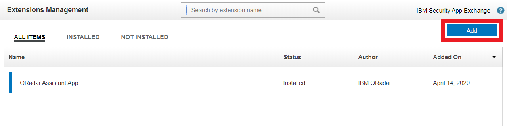
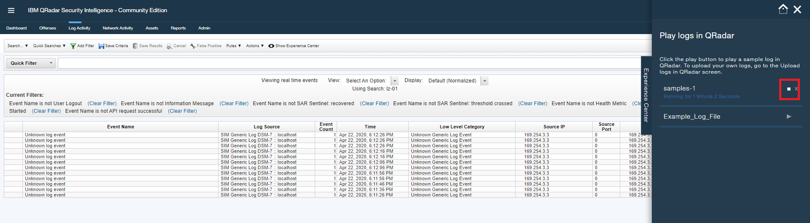
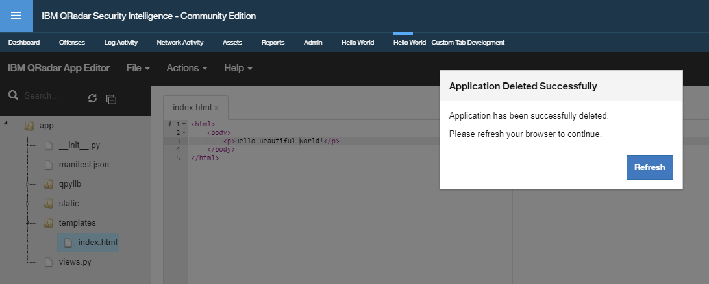

# QRadar Lab1 - Create a new DSM

## QRadar Flow

A Device Support Module (DSM) is a code module that parses received events from multiple log sources and converts them to a standard taxonomy format that can be displayed as output. 

To collect events from third-party devices/sources, you need to complete configuration tasks on the third-party device, and your QRadar Console, Event Collector, or Event Processor. The key components that work together to collect events from third-party devices are log sources, DSMs, and automatic updates.

### Log sources 

A log source is any external device, system, or cloud service that is configured to either send events to your IBM QRadar system or be collected by your QRadar system. QRadar shows events from log sources in the Log Activity tab. 

To receive raw events from log sources, QRadar supports several protocols, including syslog from OS, applications, firewalls, IPS/IDS, SNMP, SOAP, JDBC for data from database tables and views. QRadar also supports proprietary vendor-specific protocols such as OPSEC/LEA from Checkpoint.

### DSMs 

A Device Support Module (DSM) is a code module that parses received events from multiple log sources and converts them to a standard taxonomy format that can be displayed as output. Each type of log source has a corresponding DSM. For example, the IBM Fiberlink MaaS360 DSM parses and normalizes events from an IBM Fiberlink MaaS360 log source.

## Objective

After the events are collected and before the correlation can begin, individual events from your devices must be properly normalized. 

Normalization means to map information to common field names, such as event name, IP addresses, protocol, and ports. If an enterprise network has one or more network or security devices that QRadar does not provide a corresponding DSM, you can create a new DSM or use the Universal DSM. Before you define device extension information in the Log Sources window in the Admin tab, you must create an extensions document for the log source. 

This lab will walk you through steps to build a new DSM via SAM Editor in QRadar console.

### What you can do with the QRadar DSM Editor

- Extract fields
- Define custom properties
- Categorize events
- Define new QID definition

## Tools Used

You use the following tools to build a new app in QRadar.

- QRadar
- QRadar DSM Editor

## Requirements

- Access to QRadar system
- IBM ID to access `IBM X-Force Exchange / App Exchange`

## Lab Flow

During the lab, you are going to
- install the **QRadar Experience Center** into your QRadar system
- Import sample log entries into your QRadar system via **QRadar Experience Center**
- create a new DSM via **QRadar DSM Editor**
- verify the new DSM

### Part 1 - Install QRadar Experience Center

To install the **QRadar Experience Center**,

1. Download the **QRadar Experience Center** extension from the `IBM X-Force Exchange / App Exchange` (https://exchange.xforce.ibmcloud.com/). For example, **Experience_Center_v1.1.0.zip**.
    - Login to the `IBM X-Force Exchange / App Exchange` (https://exchange.xforce.ibmcloud.com/).
    - Search for `Experience Center`.
        
    - Select the `IBM Security App Exchange` checkbox in the navigation pane on the left.
    - Click `QRadar - Experience Center` link.
    - `Download`. Make sur ethe pop-up block is off for your browser.

1. Login to QRadar console.

1. Navigate to `Admin` tab.

    

1. Click `Extensions Management`.

    

1. Click `Add`.

    

1. In the `Add a New Extension` window, click `Browse` to find the app extension that you downloaded.

1. Select `Install immediately` checkbox.

1. Click `Add`. The downloaded zip file is unziped and verified. 

1. This may take a few minutes. Then, `Experience Center` window opens.

1. Select `Replace existing items (Application data is preserved)` option.

    

1. Click `Install`. 

1. Click `OK` after the `QRadar Experience Center` installation is completed.

    

1. The `QRadar Experience Center` extension appears in the `Extensions Management` window after it is installed.

    

1. Close the `Extensions Management` window. You are back to the `Admin` tab of QRadar console. 

1. Refresh your browser. This brings you to the `Dashboard` tab.

1. **Experience Center** tab appears on thr right edge of the console.

    

 
### Part 2 - Simulate log transactions by importing log file

One feature of the **QRadar Experience Center** allows you to generate log transactions in QRadar without physically connecting to your log source. Based on the simulated log transactions, you can proactively confgire the QRadar environment.

1. Login to QRadar console.

1. Navigate to `Log Activity` tab.

    

1. By deault, you may have many log entries that you may not be interested. To filter out the unwanted log transactions,
    - Pause the incoming log transactions by clicking on the `Pause` button in the top-right corner.
    - Highlight any unwanted log entry.
    - Right-click and select `Fill on Event Name is not Infromation Message`.
    - In the dropdown list of `View`, select `Real Time (streaming)`.
    - This filters out one type of your wanted log transactions. 
    - Repeat the same steps to filter out all unwanted log transactions.

1. Select the `Experience Center` to expand it.

    

1. Select `Upload logs to QRadar` menu.

1. Click `Select File` in the `Upload logs to QRadar` window.

1. Navigate to the folder where you downloaded the repo and then go to `data/` subfolder.

1. Select `samples-1.log` file and select `Open`.

    

1. Click `Next`. This leads you to the `Play logs in QRadar` window.

    

1. Click `Play` button next to the `Samples-1`. Sample log entries are sending to the QRadar console.

    

1. Click `Stop` button next to the `Samples-1` after you have 5-6 entries. 

1. This simulates sample log transactions in QRadar console without connecting to your log source physically. Now, you are ready to create a new DSM based on the sample log entries.

### Part 3 - Modify Hello World app

New application is developed in Python. To modify the Hello World app via QRadar App Editor,

1. Login to QRadar console.

1. Navigate to `Hello World - Custom Tab Development` tab. This is where you modify/develop your application. New application is developed in Python. Explore the files through the navigation menu in the left pane.

    

1. In the navigation menu of the left pane, expand folder `templates`.

    

1. Double click the `index.html` file to open it in the main section.

1. Change the code `
Hello World!
` to `
Hello Beautiful World!
`.

1. Select `File` menu from the menu bar on the top and then select `Save`.

1. Click the tab `Hello World`. Message `Hello Beautiful World!` is displayed. 

    

1. Congrtulation! You successfully modified your application.

### Part 4 - Delete Hello World app

To delete the Hello World app via QRadar App Editor,

1. Login to QRadar console.

1. Navigate to `Hello World - Custom Tab Development` tab. This is where you modify/delete your application.

    

1. Select `Action` menu from the menu bar on the top and then select `Delete App`.

1. Select `Yes`.

1. Your app will be deleted in a few seconds.

    

1. Click `Refresh` in the confirmation pop-up window. 

1. Congrtulation! You successfully deleted your application.

    

## Related Links

- [Open Cybersecurity Alliance](https://opencybersecurityalliance.org/)
- [IBM QRadar SIEM](https://www.ibm.com/products/qradar-siem)
- [IBM QRadar Log Manager](https://www.ibm.com/products/qradar-log-manager)
- [IBM QRadar Vulnerability Manager](https://www.ibm.com/products/ibm-qradar-vulnerability-manager)
- [IBM QRadar on Cloud](https://www.ibm.com/products/hosted-security-intelligence)
- [IBM QRadar Advisor with Watson](https://www.ibm.com/products/cognitive-security-analytics)
- [IBM QRadar Network Insights](https://www.ibm.com/products/real-time-threat-identification)
- [IBM QRadar Incident Forensics](https://www.ibm.com/products/ibm-qradar-incident-forensics)

